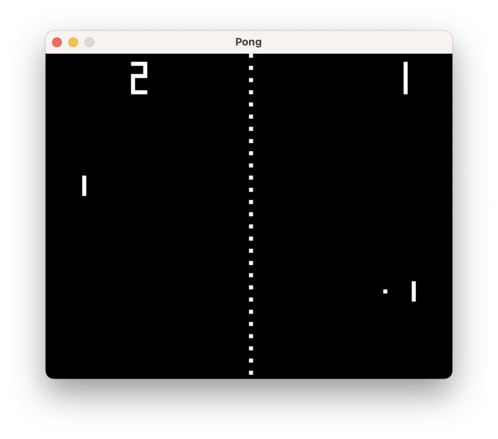

# Retro Tennis

_Gilbert François Duivesteijn_

## Abstract

_Retro Tennis, (also known as Pong) is a table tennis–themed twitch arcade sports video game, featuring simple two-dimensional graphics, manufactured by Atari and originally released in 1972._ (Source: Wikipedia)

This program runs as a native desktop application or in the browser as a WebAssembly application.


|  |  |
| ----------------------------------------- | -------------------------------------- |
| Native application                        | WebAssembly in the browser             |


## Keymaps

| key     | description      | key  | description   |
| ------- | ---------------- | ---- | ------------- |
| [w]     | player 1 up      | [u]  | player 2 up   |
| [s]     | player 1 down    | [j]  | player 2 down |
| [mouse] | player 1 up/down |      |               |
|         |                  |      |               |
| [1]     | 1 player         | [0]  | demo mode     |
| [2]     | 2 players        | [r]  | restart       |

| key         | description (desktop version only) |
| ----------- | ---------------------------------- |
| [f]         | Toggle full screen                 |
| [q] / [esc] | Quit                               |


## Building the native C application

Compiling the project should be straight forward, thanks to vcpkg. After compiling and installing, the program `pong` is located in the `<project_folder>/dist`.

```sh
git clone https://github.com/gilbertfrancois/retro-tennis.git

cd retro-tennis

# Important!
git submodule update --init --recursive

# Build the project and its dependencies
cmake -S . -B build -DCMAKE_BUILD_TYPE=Release
cmake --build build
cmake --install build
```

Test and run with:

```sh
cd dist
./pong
```


## Building the game as WebAssembly application

Compiling for the web requires some more steps. First build the C code:

```sh
git clone https://github.com/gilbertfrancois/retro-tennis.git

cd retro-tennis

# Important!
git submodule update --init --recursive

# Install emscripten (only first time)
./3rdparty/emsdk/emsdk install latest

# Activate the build toolchain
./3rdparty/emsdk/emsdk activate latest
source 3rdparty/emsdk/emsdk_env.sh

# Build the project and its dependencies
cmake -S . -B build -DCMAKE_BUILD_TYPE=Release -DWASM=1
cmake --build build
cmake --install build

# Build the HTML and JavaScript code
cd web
npm install
npm run prod
```

Test and run with:

```sh
cd web/dist
python -m http.server 8000
```

Open a browser and go to http://localhost:8000 


## Notes on compiling native C & SDL2 programs to WASM

- The usual main loop in C, a `while(true) {...}` loop cannot be used in WASM. You have to use the browser's `requestAnimationFrame` mechanism to prevent blocking all resources of the browser. Look for the `emscripten_set_main_loop_arg` and `emscripten_set_main_loop_timing` functions in the Emscripten documentation. [[source: Emscripten API]](https://emscripten.org/docs/api_reference/emscripten.h.html#c.emscripten_set_main_loop_arg)

- Make sure that the SDL2 Audio / Mixer is loaded *after* the user clicked on the canvas. Modern web browsers will not permit web pages to produce sound before the user has interacted with them. SDL-based apps also have to deal with this problem. If the user hasn't interacted with the page, SDL_OpenAudioDevice will fail and the WASM app crashes. Retro-Tennis solves it by having an intro screen with a bouncing ball. Only when the user has clicked on the canvas to start the game, the audio is initialised and plays sound successfully. [[source: SDL Wiki]](https://wiki.libsdl.org/SDL2/README/emscripten)

- The audio files need to be preloaded and packed as `target_filename.data` file, by adding `--preload-file [filename]`. If you omit this step, you won't get enough memory assigned by the `target_filename.js` WASM loader and your WASM application will crash due to memory errors.

- When you use PackerJS or Webpack to compile your JavaScript sources, you need to add `-s ENVIRONMENT='web'`  to the `C_FLAGS` in `CMakefileLists.txt`.  Emscripten's emcc command produces both .js and .wasm files. The .js file is not only a wrapper of the .wasm but also provides a C/C++ runtime for the web, and more importantly in the question, a generic loader for the .wasm file.

  The .js file's loader is very comprehensive that covers node, web, web worker, and D8 JS shell by default. This often make problems with bundlers such as Webpack because the bundlers try to resolve all modules in the source code, including require('fs') which is used for loading .wasm file in the nodejs environment, and the bundler produces error if any module is not available for the web environment.

  One way to avoid the problem is that to use ENVIRONMENT flag in emcc command. This will remove some problematic codes such as require('fs'). [[source: stackoverflow]](https://stackoverflow.com/questions/59487224/webpack-throws-error-with-emscripten-cant-resolve-fs)
  
- When you use PackerJS, you have to copy manually your .wasm and .data files in the ./dist folder. PackerJS does not know by itself that these files are needed. In this project, it has been solved by adding explicit copy commands to the `package.json` file for the *dev* and *prod* targets.
